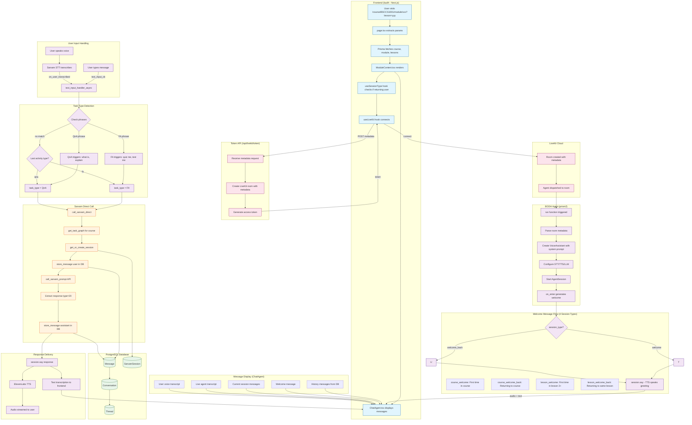
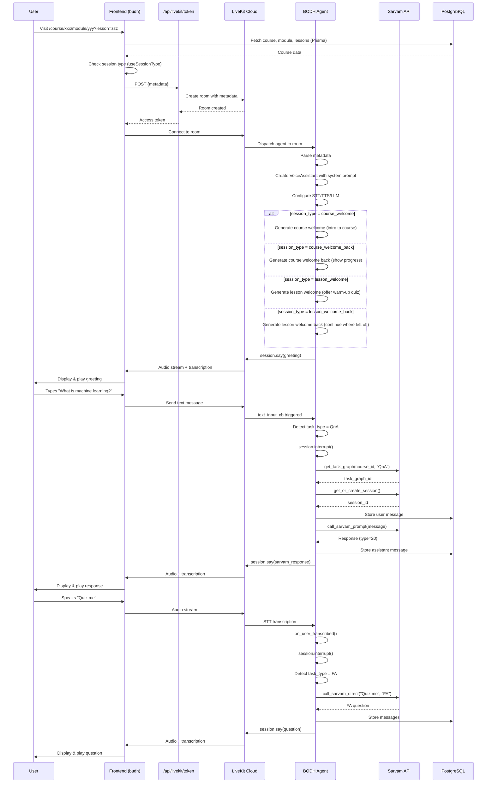

# BODH System Flow Diagrams

This document contains comprehensive Mermaid diagrams explaining the complete flow of the BODH learning system.

## Table of Contents
- [Overview](#overview)
- [Complete System Flowchart](#complete-system-flowchart)
- [Sequence Diagram](#sequence-diagram-time-based-flow)
- [Component Architecture](#component-architecture-diagram)
- [State Flow Diagram](#state-flow-diagram)
- [Key Components Summary](#key-components-summary)

---

## Overview

BODH is an AI-powered learning assistant that:
1. **Frontend (budh)**: Next.js app that displays courses, modules, lessons, and chat interface
2. **Backend Agent (prism2)**: Python LiveKit agent that handles voice/text interactions
3. **Sarvam AI**: External API for course-specific Q&A and Formative Assessments
4. **LiveKit Cloud**: Real-time communication infrastructure

### Key Insight
User input (text or voice) **bypasses the main LLM** and calls **Sarvam API directly** for educational content. The main LLM (Gemini) is only used for welcome messages.

---

## Complete System Flowchart



---

## Sequence Diagram (Time-based flow)



---

## Component Architecture Diagram

```mermaid
graph TB
    subgraph "User Browser"
        UI[Chat UI]
        Audio[Audio Player]
        Mic[Microphone]
    end

    subgraph "Frontend - budh (Next.js)"
        subgraph "Pages"
            Page["page.tsx<br/>(Server Component)"]
            Module["ModuleContent.tsx<br/>(Client Component)"]
        end

        subgraph "Hooks"
            H1[useLiveKit]
            H2[useChatSession]
            H3[useSessionType]
        end

        subgraph "Components"
            CA[ChatAgent]
            CM[ChatMessage]
            MC[MessageContent]
        end

        subgraph "API Routes"
            T1[/api/livekit/token]
            T2[/api/message]
            T3[/api/thread]
        end
    end

    subgraph "LiveKit Cloud"
        Room[LiveKit Room]
        RTC[WebRTC]
    end

    subgraph "Backend - prism2 (Python)"
        subgraph "Agent"
            VA[VoiceAssistant]
            TIH[text_input_handler_async]
            SDD[call_sarvam_direct]
        end

        subgraph "Prompts"
            SP[System Prompt - Aditi]
            CWP[Course Welcome Prompt]
            CWBP[Course Welcome Back Prompt]
            LWP[Lesson Welcome Prompt]
            LWBP[Lesson Welcome Back Prompt]
        end

        subgraph "AI Services"
            LLM[Google Gemini LLM]
            STT[Sarvam STT]
            TTS[ElevenLabs TTS]
        end

        subgraph "Sarvam Integration"
            ST[SarvamTools]
            TG[get_task_graph]
            SS[get_or_create_session]
            SP2[call_sarvam_prompt]
        end
    end

    subgraph "External APIs"
        SarvamAPI[Sarvam AI API]
        ElevenLabs[ElevenLabs API]
        GoogleAI[Google AI API]
    end

    subgraph "Database"
        PG[(PostgreSQL)]
    end

    %% Connections
    UI <--> Module
    Audio <--> Module
    Mic <--> Module

    Page --> Module
    Module --> H1 & H2 & H3
    Module --> CA --> CM --> MC

    H1 <-->|WebSocket| Room
    H2 <-->|REST| T2 & T3
    T1 <-->|REST| Room

    Room <-->|WebRTC| RTC
    Room <--> VA

    VA --> TIH --> SDD
    VA --> SP & WP & WBP

    SDD --> ST --> TG & SS & SP2
    SP2 <--> SarvamAPI

    VA <--> LLM <--> GoogleAI
    VA <--> STT
    VA <--> TTS <--> ElevenLabs

    T2 & T3 <--> PG
    SDD <--> PG
```

---

## State Flow Diagram

```mermaid
stateDiagram-v2
    [*] --> PageLoad: User visits URL

    state PageLoad {
        [*] --> ExtractParams
        ExtractParams --> FetchData
        FetchData --> CheckSession
        CheckSession --> InitLiveKit
    }

    PageLoad --> Connecting: LiveKit init

    state Connecting {
        [*] --> RequestToken
        RequestToken --> CreateRoom
        CreateRoom --> JoinRoom
        JoinRoom --> AgentDispatched
    }

    Connecting --> AgentReady: Connected

    state AgentReady {
        [*] --> ParseMetadata
        ParseMetadata --> CreateAssistant
        CreateAssistant --> ConfigureAI
        ConfigureAI --> StartSession
    }

    AgentReady --> Welcome: on_enter()

    state Welcome {
        [*] --> CheckSessionType
        CheckSessionType --> CourseWelcome: course_welcome
        CheckSessionType --> CourseWelcomeBack: course_welcome_back
        CheckSessionType --> LessonWelcome: lesson_welcome
        CheckSessionType --> LessonWelcomeBack: lesson_welcome_back
        CourseWelcome --> SpeakGreeting
        CourseWelcomeBack --> SpeakGreeting
        LessonWelcome --> SpeakGreeting
        LessonWelcomeBack --> SpeakGreeting
    }

    Welcome --> Idle: Welcome complete

    state Idle {
        [*] --> WaitingForInput
    }

    Idle --> ProcessingInput: User input received

    state ProcessingInput {
        [*] --> DetectInputType
        DetectInputType --> TextInput: text
        DetectInputType --> VoiceInput: voice

        VoiceInput --> STTTranscribe
        STTTranscribe --> TextHandler
        TextInput --> TextHandler

        TextHandler --> DetectTaskType
        DetectTaskType --> QnA: question detected
        DetectTaskType --> FA: quiz detected
        DetectTaskType --> CheckLastActivity: no match

        CheckLastActivity --> QnA: last = qna
        CheckLastActivity --> FA: last = fa
    }

    ProcessingInput --> CallingSarvam: Task type determined

    state CallingSarvam {
        [*] --> GetTaskGraph
        GetTaskGraph --> GetSession
        GetSession --> StoreUserMsg
        StoreUserMsg --> CallAPI
        CallAPI --> ExtractResponse
        ExtractResponse --> StoreAssistantMsg
    }

    CallingSarvam --> Responding: Response received

    state Responding {
        [*] --> InterruptCurrent
        InterruptCurrent --> SpeakResponse
        SpeakResponse --> StreamToFrontend
    }

    Responding --> Idle: Response complete
```



---

## Key Components Summary

### Frontend (budh - Next.js)

| File | Purpose |
|------|---------|
| `app/(learning)/course/[courseId]/module/[moduleId]/page.tsx` | Server component, fetches data via Prisma |
| `app/(learning)/course/[courseId]/module/[moduleId]/ModuleContent.tsx` | Client component, LiveKit connection |
| `components/agent/ChatAgent.tsx` | Message display and history management |
| `components/chat/ChatMessage.tsx` | Individual message rendering |
| `hooks/useLiveKit.ts` | LiveKit connection and event handling |
| `hooks/useChatSession.ts` | Chat state and message storage |
| `hooks/useSessionType.ts` | Determines 4 session types based on course/lesson progress |
| `app/api/session-type/route.ts` | API to check Enrollment + LessonProgress |
| `app/api/livekit/token/route.ts` | Token generation and room creation |

### Backend Agent (prism2 - Python)

| File | Purpose |
|------|---------|
| `app/agents/livekit/bodh/agent.py` | Main agent logic, VoiceAssistant class |
| `app/agents/livekit/bodh/prompts.py` | System prompt for Aditi personality |
| `app/agents/livekit/bodh/sarvam_tools.py` | Sarvam API integration |
| `app/agents/livekit/bodh/tools.py` | Video search tools |

### Metadata Sent to Agent

```typescript
{
  course_id: string,
  course_title: string,
  course_description?: string,
  learning_objectives?: string,
  module_id: string,
  module_title: string,
  lesson_id?: string,
  lesson_title?: string,
  lesson_number?: number,           // 1-based lesson order
  prev_lesson_title?: string,       // Previous lesson title for warm-up
  user_id: string,
  user_name?: string,
  // Session type (4 types based on course + lesson progress)
  session_type: "course_welcome" | "course_welcome_back" | "lesson_welcome" | "lesson_welcome_back",
  // Session context from useSessionType hook
  isFirstCourseVisit: boolean,      // First time in this course?
  isIntroLesson: boolean,           // Is this the intro (first) lesson?
  isFirstLessonVisit: boolean,      // First time in this specific lesson?
  courseProgress?: {
    completedLessons: number,
    totalLessons: number,
    lastLessonTitle: string | null,
  },
  lessonProgressData?: {
    completionPercentage: number,
    lastPosition: number,
    status: string,
  },
  video_ids: string[],
  interaction_mode: "text_to_speech" | "speech_to_speech",
}
```

### Session Types (New 4-Level System)

| Session Type | When Triggered | Greeting Behavior |
|-------------|----------------|-------------------|
| `course_welcome` | First time in course, on intro lesson | Welcome to course, intro to learning objectives |
| `course_welcome_back` | Returning user, on intro lesson | Welcome back, show course progress |
| `lesson_welcome` | First time in lesson 2+ | Offer warm-up quiz from previous lesson |
| `lesson_welcome_back` | Returning to same lesson | Continue where left off, show lesson progress |

### Task Type Detection

| User Says | Detected As |
|-----------|-------------|
| "Quiz me on this topic" | FA |
| "Test my understanding" | FA |
| "What is machine learning?" | QnA |
| "Explain this concept" | QnA |
| "Option B" (after FA question) | FA (continuing session) |
| "Hello" | QnA (default) |

### AI Services Used

| Service | Purpose |
|---------|---------|
| Google Gemini | Welcome message generation only |
| Sarvam STT | Speech-to-text transcription |
| ElevenLabs TTS | Text-to-speech (Monica voice) |
| Sarvam API | Course Q&A and Formative Assessments |

---

## Data Flow Summary

```
┌─────────────────────────────────────────────────────────────────┐
│                     NORMAL LIVEKIT FLOW                         │
│         User → STT → LLM (Gemini) → TTS → Response              │
└─────────────────────────────────────────────────────────────────┘

┌─────────────────────────────────────────────────────────────────┐
│                      BODH CUSTOM FLOW                           │
│         User → STT → Sarvam API directly → TTS → Response       │
│                      (bypasses main LLM)                        │
└─────────────────────────────────────────────────────────────────┘
```

The key innovation is that `text_input_handler_async` intercepts all user input and routes it to Sarvam API instead of the default LLM pipeline. This ensures educational content comes from Sarvam's course-specific knowledge base.
